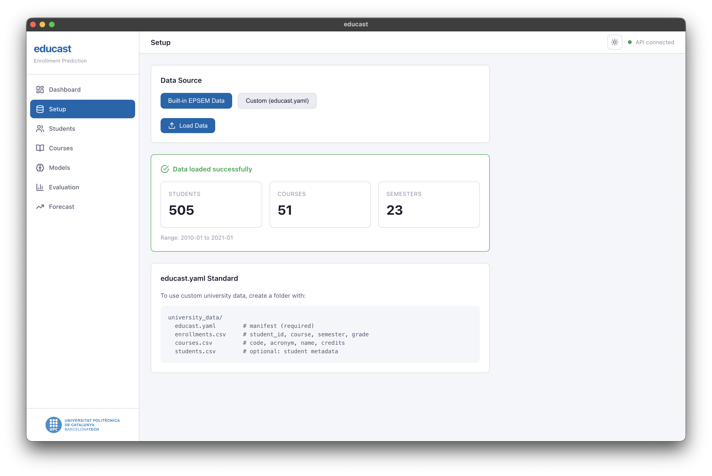

# EduCast: Hierarchical Forecasting for Student Enrollment

**Master's Thesis (TFM)**, MERIT, EPSEM-UPC  
**Author:** Anass Anhari  
**Academic Year:** 2025–2026

## Abstract

This project implements and evaluates multiple forecasting models for predicting per-course student enrollment at EPSEM-UPC, a Spanish engineering school. The main contribution is a student-profile LSTM (Micro LSTM) that processes individual academic histories encoded as 153-dimensional multi-hot feature vectors (enrollment flags, normalized grades, and attempt counts per course). Results show that the Micro LSTM achieves a global MAE of 1.73 students/course on held-out test semesters, outperforming aggregate-level baselines (Macro LSTM MAE = 5.57, Naïve MAE = 4.18). A per-course weighted reconciliation scheme further reduces MAE to 1.43.

---

## Research Questions

- **RQ:** Can student-level sequential models outperform aggregate-level baselines for per-course enrollment forecasting?
- **SRQ1:** How does the 153-dim multi-hot feature vector compare to simpler tabular representations?
- **SRQ2:** Does hierarchical reconciliation improve forecast accuracy over standalone models?
- **SRQ3:** How sensitive is the Micro LSTM to architectural choices (hidden size, depth, window, dropout)?
- **SRQ4:** Can course embeddings (Course2Vec) improve the model's representation of curriculum structure?
- **SRQ5:** Does a Differencing LSTM variant improve Macro LSTM stability?

---

## Models

| Model | Type | Description |
|---|---|---|
| Naïve | Baseline | Last-semester persistence (lag-2) |
| Micro LSTM | Deep learning | Student-profile LSTM on 153-dim multi-hot sequences |
| Macro LSTM | Deep learning | Aggregate enrollment time series regression |
| Differencing LSTM | Deep learning | First-order differenced Macro LSTM |
| Decision Tree | Tree-based | Per-subject sklearn decision tree (TFG baseline) |
| Random Forest | Tree-based | Per-subject random forest with OOB optimization |
| XGBoost | Gradient boosting | Per-subject XGBoost with class-imbalance weighting |
| Course2Vec MLP | Embedding + MLP | Skip-gram course embeddings + flattened window MLP |

---

## Key Results

| Model | MAE |
|---|---|---|---|
| Naïve (lag-2) | 4.18 |
| Macro LSTM | 5.57 |
| Course2Vec MLP | 1.78 |
| **Micro LSTM** | **1.73** |
| Per-course Reconciliation | **1.43** |

Full per-course breakdowns are in `results/tables/`; plots are in `results/figures/`.

---

## Desktop App (EduCast)

The repository includes a full-stack desktop application built with Electron + React (frontend) and FastAPI (backend), with an interactive interface for loading data, training models, visualizing enrollment heatmaps, and inspecting per-student predictions.



### Running the app

```bash
# 1. Install Python backend
pip install -e ".[app]"

# 2. Install Node dependencies
cd app && npm install

# 3. Start in development mode
npm run dev
```

The Electron app automatically starts the FastAPI server on port 8765.

---

## Setup

Make sure you have `Python >= 3.12` and `make` available.

1. Create and activate a clean Python environment

```bash
python3.12 -m venv env
source env/bin/activate
```

2. Install the framework and dependencies

```bash
pip install -r requirements.txt
# or
pip install -e ".[dev]"
```

### Running experiments from CLI

> ![NOTE]
> Keep in mind that the data is confidential and for this reason you will not be able to train the models!

```bash
# Train all models
make train

# Train a single model
python -m educast.experiments.runner --experiment micro_lstm

# Run tests
make test
```

Available experiment names: `naive`, `macro_lstm`, `micro_lstm`, `course2vec_mlp`, `decision_tree_d4_t1`, `decision_tree_d4_t2`, `random_forest_t1`, `random_forest_t2`, `xgboost_t2`.

---

## Data

The dataset consists of anonymized student enrollment records from EPSEM-UPC (2010–2023). It is **confidential** and not included in this repository.

To reproduce results, you need:
- `data/interim/EPSEM_data_private/EPSEM_semester.educast.json`: preprocessed university JSON
- `data/raw/EPSEM_data_private/TIC/matricules.anon.csv`: raw enrollment CSV (for enrichment)
- `data/raw/EPSEM_data_private/TIC/acronims.tic.csv`: course acronym mapping

---

## Project Structure

```
educast/              Python package (models, features, evaluation, server)
  config.py           Central path and hyperparameter configuration
  data/               Data loading, schema, transforms, train/test splits
  models/             LSTM, ARIMA, Naïve, tree-based, and embedding models
  features/           Multi-hot encoding and tabular feature extraction
  evaluation/         MAE metrics and result export utilities
  experiments/        Experiment registry and runner (CLI)
  server/             FastAPI backend for the desktop app

app/                  Electron + React desktop application
  electron/           Main process and preload scripts
  src/                React pages, chart components, and API client

notebooks/            Jupyter notebooks for EDA and model experiments
scripts/              Figure export scripts (PGF for LaTeX)
results/
  figures/            Plots and heatmaps (.png)
  tables/             Metric summaries (.json, .csv)
configs/
  hyperparameters.yaml  All default hyperparameter settings
tests/                pytest unit tests
```
